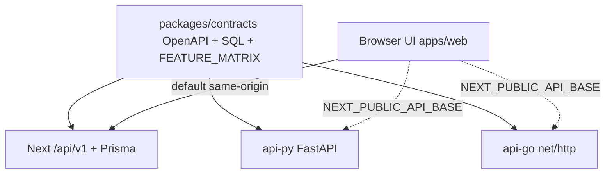

# Multi-backend architecture (DocuSign-parity)

HRSign ships **three independent Envelope API backends** behind one OpenAPI contract. They do **not** call each other.

## Delivery order (locked)

1. **Next.js** (`apps/web`) — primary product UI + reference `/api/v1` implementation (Prisma / Postgres).
2. **Python** (`apps/api-py`) — FastAPI port of the same contract (in-memory until `HRSIGN_DATABASE_URL`).
3. **Go** (`apps/api-go`) — Go HTTP port of the same contract (in-memory until `HRSIGN_DATABASE_URL`).



## Shared artifacts

| Artifact | Path |
|----------|------|
| OpenAPI 3 | [`packages/contracts/openapi/docusign-parity.yaml`](../../packages/contracts/openapi/docusign-parity.yaml) |
| Envelope DDL | [`packages/contracts/schema/envelope.sql`](../../packages/contracts/schema/envelope.sql) |
| Status matrix | [`packages/contracts/FEATURE_MATRIX.md`](../../packages/contracts/FEATURE_MATRIX.md) |
| State machines | [`packages/contracts/state-machines/`](../../packages/contracts/state-machines/) |
| TS SDK (partial) | [`packages/sdk-ts`](../../packages/sdk-ts) |
| Contract smoke | `pnpm contract:test` → [`scripts/contract-test.mjs`](../../scripts/contract-test.mjs) |

## Runtime selection

Leave `NEXT_PUBLIC_API_BASE` empty → browser calls Next `/api/v1/...`.

```bash
# Point the UI at Python or Go (standalone — they never call Next)
NEXT_PUBLIC_API_BASE=http://localhost:8000/v1   # Python
NEXT_PUBLIC_API_BASE=http://localhost:8080/v1   # Go
```

Helper: [`apps/web/src/lib/api-base.ts`](../../apps/web/src/lib/api-base.ts).

## Rules for contributors

1. **Contract first** — change OpenAPI (and FEATURE_MATRIX row) before implementing.
2. Ship the capability in **Next**, then port Py/Go to the same status codes and JSON shapes.
3. Py/Go must not import Next code or HTTP-call Next.
4. A phase is “open-source complete” only when all three backends pass `pnpm contract:test` for that surface.
5. Persistence for Py/Go is optional (`HRSIGN_DATABASE_URL` + shared SQL); Next remains the durable reference with Prisma.

## Current maturity

See [`FEATURE_MATRIX.md`](../../packages/contracts/FEATURE_MATRIX.md). Core envelope lifecycle is `done` on all three; product surfaces (Clickwrap, Rooms, CLM, Notary, Connect, hosted sign, conditional tabs) are typically `partial` with in-memory Py/Go stores.

## Local smoke

```bash
# terminals: uvicorn :8000 , go run :8080
PY_URL=http://127.0.0.1:8000/v1 GO_URL=http://127.0.0.1:8080/v1 pnpm contract:test
```
