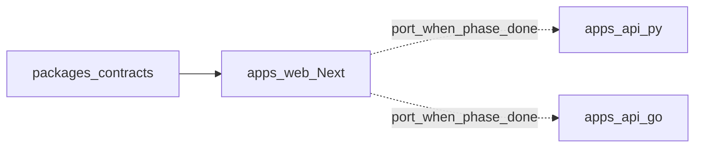

# HRSign Contracts (open-source)

**Delivery order (locked):**

1. **Next.js first** (`apps/web`) — DocuSign product-surface parity lives here  
2. **Then Python** (`apps/api-py`) — independent port of the same OpenAPI  
3. **Then Go** (`apps/api-go`) — independent port of the same OpenAPI  

Python / Go **never call Next**. They re-implement the contract. Until a Phase is done in Next, sibling backends may stay `stub` on that row in [`FEATURE_MATRIX.md`](./FEATURE_MATRIX.md).

| Backend | Path | Role |
|---------|------|------|
| **TypeScript / Next** | [`apps/web`](../../apps/web) | Primary implementation + UI |
| **Python / FastAPI** | [`apps/api-py`](../../apps/api-py) | Port after Next (standalone) |
| **Go** | [`apps/api-go`](../../apps/api-go) | Port after Next (standalone) |

## Rules

1. Contract first — change OpenAPI before code.  
2. Implement + ship in **Next**, then port Py/Go to match.  
3. Same status codes & JSON; same Postgres DDL.  
4. A Phase is “open-source complete” only when all three backends pass `pnpm contract:test` for that Phase.

## Layout

| File / dir | Purpose |
|------------|---------|
| [`openapi/docusign-parity.yaml`](./openapi/docusign-parity.yaml) | Canonical Envelope API |
| [`schema/envelope.sql`](./schema/envelope.sql) | Shared DDL for future Py/Go Postgres |
| [`FEATURE_MATRIX.md`](./FEATURE_MATRIX.md) | Per-backend capability status |
| [`state-machines/`](./state-machines/) | Envelope / recipient state YAML |

See also: [`docs/architecture/multi-backend.md`](../../docs/architecture/multi-backend.md).

License: Apache-2.0.
