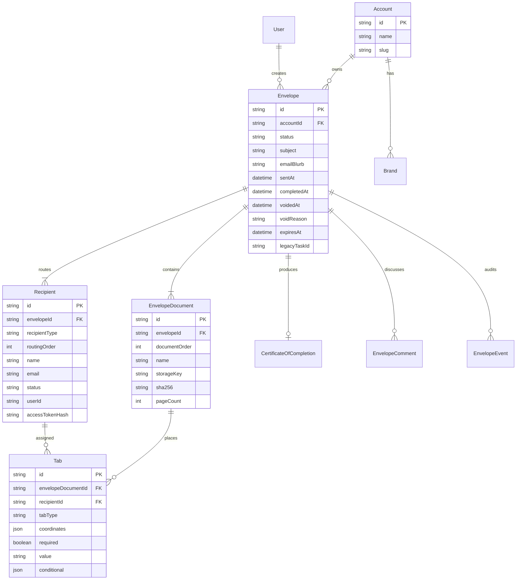

# Envelope domain ERD

## Status enums

See `state-machines/envelope.yaml` and `state-machines/recipient.yaml`.

## Legacy bridge

`Envelope.legacyTaskId` → optional FK to `SigningTask` for dual-read during migration.
Older HR APIs (`/api/tasks`) remain until UI cutover completes.
